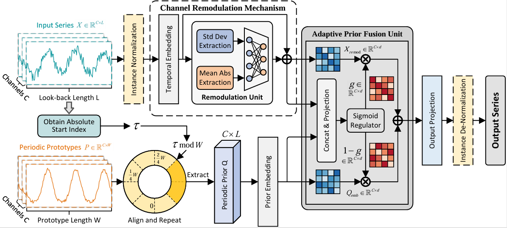

# PRNet: Adaptive Periodicity Perception and Channel Remodulation for Multivariate Time Series Forecasting

This is the official implementation of PRNet.

PRNet is a lightweight yet powerful MLP-based framework designed to address two fundamental challenges in multivariate time series forecasting: 
1. The receptive field limitation of local window feature extraction.
2. The adaptability bottleneck of static shared weights in predictors when facing heterogeneous channels.

## Key Features

- **Adaptive Periodicity Perception (APPM)**: Transcends the limits of local receptive fields by explicitly modeling global periodic prototypes and extracting phase-synchronized priors.
- **Channel Remodulation Mechanism (CRM)**: Breaks the "one-size-fits-all" mapping of static shared predictors by utilizing statistical features (Standard Deviation and the Mean of Absolute Values) to dynamically adjust the representation intensity of heterogeneous channels.
- **Adaptive Prior Fusion (Point-level)**: Implements a fine-grained, point-level regulation matrix to adaptively balance current observations and global periodic guidance, enhancing robustness against non-stationary perturbations.

## Environment Requirements

- Python 3.12
- PyTorch 2.7.0
- Dependencies listed in requirements.txt

## Data Preparation

1. **Download Datasets**: You can download the pre-processed multivariate datasets from this [Google Drive Link](https://drive.google.com/file/d/1bNbw1y8VYp-8pkRTqbjoW-TA-G8T0EQf/view).
2. **Organization**: Create a directory named `./dataset/` in the root folder and place the downloaded files (e.g., ETTh1.csv, Weather.csv, PEMS04.npz, etc.) into it.

## Training & Reproduction

We provide reproduction scripts for 12 multivariate datasets including the ETT series, Weather, Electricity, Traffic, Solar-Energy, and PEMS (03, 04, 07, 08).

**Run a specific dataset (e.g., Electricity):**
bash scripts/multivariate_forecast/Electricity.sh

**Run batch experiments:**
bash run_main.sh

## Performance

PRNet achieves State-of-the-Art (SOTA) performance on 9 out of 12 real-world datasets across various predictive scales, outperforming various competitive Transformer-based and MLP-based baselines.